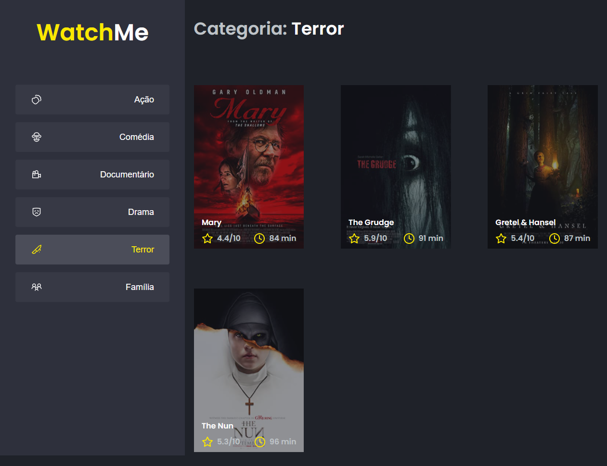

<h1 align="center" id="#BannerWatchMe">
  
</h1>

<h2 id="#sobre-o-projeto">Sobre o projeto</h2>

É um pequeno site <em>One Page</em> que mostra um catálogo de filmes de acordo com o gênero escolhido dentre os que estão diponíveis.

Esse site também foi baseado em um template da Rocketseat a fim de treinar conceitos base do React. Desta vez, o foco esteve em melhorar a <em>componentização da aplicação</em>, isto é, modificar a divisão dos arquivos que constituem o site para alguma outra forma de organização que fizesse mais sentido.